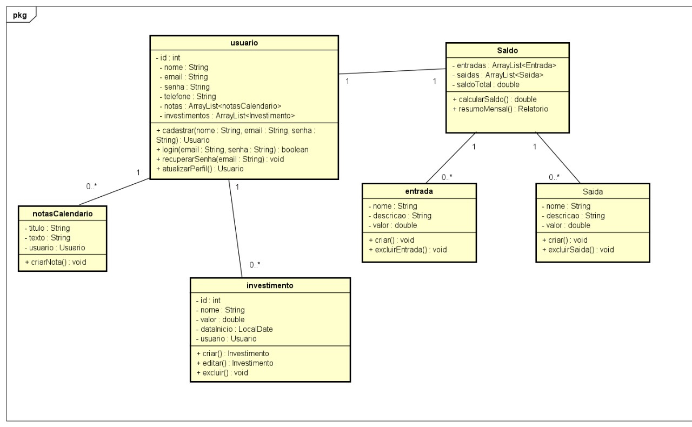

# **Easy - Gestor Financeiro**

 

## **📌 Introdução**

O **Easy** é um sistema de gestão financeira pessoal, simples e intuitivo, desenvolvido com o objetivo de facilitar o controle de entradas, gastos e investimentos. A proposta é fornecer uma visão clara e organizada das finanças do usuário, com recursos que permitem o acompanhamento do saldo geral, categorização de movimentações e aplicação de filtros por data, otimizando a análise e o planejamento financeiro.

Ideal tanto para uso acadêmico quanto para o gerenciamento cotidiano de finanças pessoais, o Easy une praticidade e eficiência em uma interface amigável.

 

## **🎯 Descrição da Proposta**

O sistema foi desenvolvido considerando a organização das movimentações financeiras do usuário em três categorias principais: **entradas, gastos e investimentos**. As entidades foram escolhidas com base nos elementos essenciais de qualquer controle financeiro pessoal. A seguir estão as principais entidades e seus relacionamentos:

- **Usuário:** acessa e gerencia seus próprios dados financeiros.
- **Movimentação:** representa qualquer entrada ou saída financeira.
- **Categoria:** define o tipo da movimentação (ex: alimentação, salário, lazer).
- **Investimento:** entidade separada com campos específicos como rendimento.

As entidades se relacionam de forma que cada movimentação pertence a um usuário e pode estar vinculada a uma categoria. Os investimentos também pertencem a usuários e armazenam valores e datas de rendimento.

 

## **🖥️ Descrição das Telas**

### **Tela de Login**

- **Campos de cadastro:** e-mail, senha.
- **Campos obrigatórios:** todos.
- **Validações:** formato de e-mail e senha obrigatória.
- **Fluxo de edição:** não aplicável.
- **Fluxo de exclusão:** não aplicável.

### **Tela de Cadastro**

- **Campos de cadastro:** nome, e-mail, senha, confirmar senha.
- **Campos obrigatórios:** todos.
- **Validações:**
  - Nome não pode estar vazio.
  - E-mail precisa conter “@” e domínio válido.
  - Senha e confirmação devem ser iguais.

### **Tela Geral**

- Exibe:
  - Total de **gastos**, **investimentos** e **notas**.
  - **Gráfico interativo** com seleção de períodos.

### **Tela de Saldo**

- Exibe:
  - Comparativo entre **entradas** e **gastos**.
  - Indicadores de saldo disponível.

### **Tela de Gastos**

- **Dados de listagem:** nome do gasto, valor, data, categoria.
- **Campos de busca:** por data, valor e categoria.
- **Campos editáveis:** nome do gasto, valor e categoria.
- **Fluxo de edição:** ao clicar em "Editar", campos se tornam editáveis.
- **Fluxo de exclusão:** botão de exclusão com confirmação.

### **Tela de Investimentos**

- **Dados de listagem:** nome, valor investido, rendimento, data.
- **Campos de busca:** por nome e data.
- **Campos editáveis:** valor investido e rendimento.
- **Fluxo de edição:** semelhante ao da tela de gastos.
- **Fluxo de exclusão:** com confirmação.

### **Tela de Filtro por Data**

- **Campos de busca:** data de início e fim.
- **Validações:** datas devem ser válidas e em ordem cronológica.

 

## **✅ Validações Implementadas**

### **🔐 Tela de Cadastro**

- Verificação do campo **nome** (obrigatório).
- Verificação de **formato de e-mail**.
- Comparação entre **senha** e **confirmar senha**.

### **🔓 Tela de Login**

- Verificação de preenchimento dos campos **e-mail** e **senha**.
- Validação de formato de e-mail.

 

## **🧩 Diagrama de Classes**

